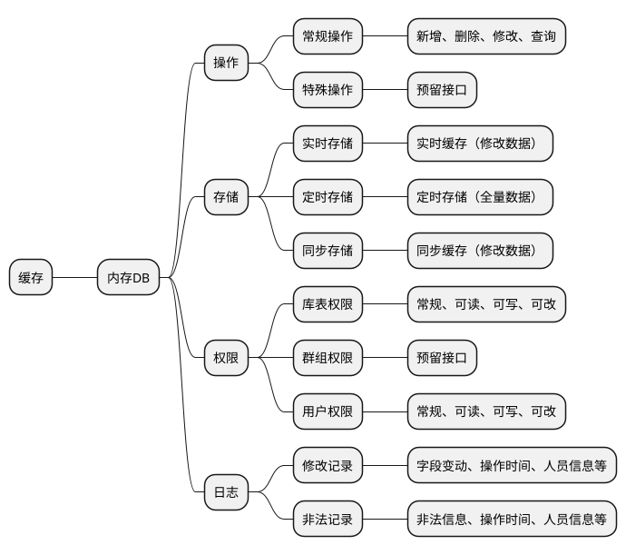

数据缓存--内存数据库，功能设计构思，及后续开发应用构想。

### 版本

| 名称 | 内存数据库 | <b>版本号 | v1.0.0 |
| :----- | :--- | :----- | :--- |
| <b>说明 | 实现简易内存数据功能，脱离关系型数据库 | <b>归属子类 | 简易学习 |
| <b>创建者 | 张斌 | <b>日期 | 2021-05-31 |

### 内存数据库

### 功能设计

#### 存储
##### 实时存储

1、有新增、修改、删除等改动时，同步进行实时缓存；
2、以独立文件方式进行缓存，时间戳+ID号作文件名（确保唯一）；
3、默认实时缓存文件夹，可自定义配置；

##### 定时存储

1、固定时间进行全量数据文件写入，固定时间可限制；
2、定时存储冷数据到历史数据文件，可设置冷数据时间；
3、写入多文件，单一文件大小限制，可配置；
4、有实时缓存，数据已经全量分布保存，没有必要启动定时存储；

##### 同步存储

1、同步实时缓存数据到存储文件，并及时存储文件；
2、载入数据时，同步；
3、定时存储时，酌情同步处理；

#### 操作
##### 查询

1、区分冷热数据查询，默认热数据查询；
2、独立冷数据查询，数据后加载，自动回收；