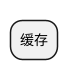

个人机器人，功能设计构思，及后续开发应用构想。

### 版本

| 名称 | 个人Robot | <b>版本号 | v1.0.0 |
| :----- | :--- | :----- | :--- |
| <b>说明 | 实现机器人功能，辅助处理各类信息| <b>归属子类 | 数据缓存 |
| <b>创建者 | 张斌 | <b>日期 | 2021-06-16 |

### 内存数据库

### 功能设计

#### Robot权限逻辑：
    a. 后台robot：
    b. 单一实例：只实例一个，为后台 + 系统级；
        多实例
    c. 群组生效：对哪些群组有效，为ALL全部生效，可逐一设置（群组名+平台名）--？主动配置，功能绑定该群；
    d. 私聊生效：对非群组生效，为ALL全部生效，可逐一设置（用户名+平台名）--？主动配置，功能绑定该用户；
    e. 绑定生效：操作目标标识，如操作的账单标识，可绑定多个账单；
    f. 用户权限：使用功能的权限，为ALL全部生效，可逐一设置（用户名+平台名）--？主动配置；
    g. 权限配置：配置文件配置基础权限（默认有权限用户，自动同步库，默认忽略自己）；

功能场景：

        Note、复读机、
        账单管家：+帐、改账、群内操作、操作权限（可增减）、多人--（b、）
        多多资源：+分、-分、群内操作、操作权限（可增减）、多人--（b、）

        逻辑：
            1). 实例生效 -> 未初始？-> 默认配置生成（群组有效？、全部群组有效？、群组全员有效？、私聊有效？、私聊全员有效？）；
                        -> 已初始;

            2). 群内/helper命令（命令 + 群名）--> 群组生效（失效）--> 功能绑定该群；
                群内/helper命令（命令 + 群名 + 用户名）--> 群组用户生效（失效）--> 功能绑定该群组用户--非群组全员有效时;
                
            3). 私聊/helper命令（命令 + 功能名）--> 私聊用户生效（失效）--> 功能绑定该用户；
                私聊/helper命令（命令 + 功能名） + 用户名）--> 私聊用户生效（失效）--> 功能绑定该用户--非群组全员有效时;

            库表1：功能名称、群组名、用户名、绑定Tag
            示例1：账单管家、ALL、ALL、朱之家
                  多多资源、测试群、猪猪、多多猪
                

            1). helper命令（命令 + 参数）-->功能生效（失效）
                                        -->功能设置参数
            库表1：功能名称、群组名、绑定Tag、功能生效、自动退出时间
            示例1：账单管家、朱之家、多多猪、true、300S